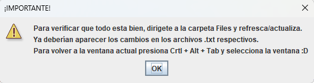

# Supermarkets_Adm
Application to help the administration of an important chain of stores

>##How Run
> - If you want to clone the project [here](https://github.com/castellanossss/Supermarkets_Adm.git)
> - If possible, run it with Eclipse IDE

>##Pay Attention
> - Read all instructions carefully
> - It is important that you know the context of the project

Let's get started!

#First Step
Follow this path -> src/presenter  
Once there, run the app  
  
  
##The first menu will show up
  
  
  If you want to exit, that's ok, just type 2 in the field box and the app will close  
  But... If you type 1 in the field box...

##The second menu will show up
  
  
  If you want to exit, that's ok, seriusly, just type 2 in the field box and the app will close  
  
  If you want to register a new Customer or Supplier or Product or Sale, select the respective option and the app will ask you for the necesary data.  
  
  Once you finish registering the necessary data, the following message will be displayed...

##Important INFO MESSAGE
  
  
  Read the message, check the obtained info and follow the steps to return to the console, it's pretty simple, right?  
    
  Once you click the ok button...
  
##The third menu will show up
  
  
  If you want to exit, that's completely fine, just type 2 in the field box and the app will close  
    
  But... If you want to keep adding data and so on, type 1 in the field box and you will be right back at the second menu, cool isn't it? 
  
#That's it for now...
Feel free to ask whatever you want.  
  
  Enjoy the app :)
